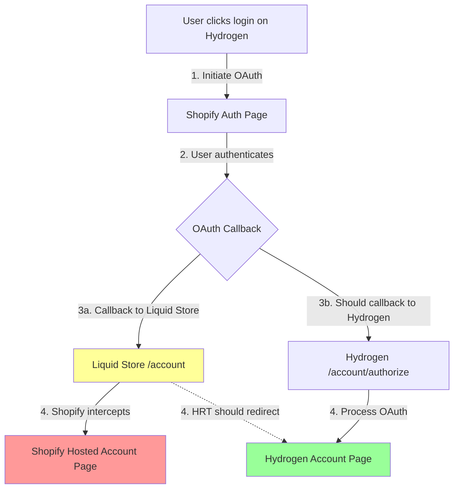

# Customer Account API Redirect Issue Analysis

## TL;DR

The Hydrogen Redirect Theme fails to redirect account pages when using new Customer Account API because:
1. OAuth callbacks land on the Liquid store domain (not Hydrogen)
2. Shopify immediately redirects authenticated users to hosted account pages
3. The theme's redirect JavaScript never gets a chance to execute

**Quick Fix:** Configure OAuth callbacks to point directly to your Hydrogen storefront instead of the Liquid store.

## Issue Summary

The Hydrogen Redirect Theme (HRT) does not redirect customer account pages (`/account`) when using Shopify's new Customer Account API, as reported in [GitHub Issue #3031](https://github.com/Shopify/hydrogen/issues/3031).

## Context: Hydrogen Redirect Theme Purpose

The Hydrogen Redirect Theme is designed to redirect traffic FROM a Liquid store TO a Hydrogen storefront. When launching a Hydrogen storefront, merchants typically want to redirect any traffic that hits their Liquid store to their new headless storefront, while retaining features like bot detection checkpoints and discount links.

## Root Cause Analysis

### The OAuth Callback Flow Problem

The issue occurs due to a conflict in the OAuth authentication flow when using new Customer Account API with both a Liquid store and a Hydrogen storefront:

1. **Authentication Flow with New Customer Accounts:**
   - User on Hydrogen storefront clicks login/account
   - Hydrogen redirects to Shopify's hosted authentication page via `/account/login` route
   - After successful authentication, the OAuth callback should return to `https://hydrogen-store.com/account/authorize`
   - **Critical Issue:** The callback URL is misconfigured to point to the Liquid store domain instead
   - The Liquid store with HRT receives the OAuth callback and should redirect to Hydrogen
   - But Shopify intercepts account page requests and redirects to hosted account pages instead

2. **Why Account Pages Don't Redirect:**
   - When authenticated users land on `/account` in the Liquid store after OAuth callback
   - Shopify's new customer account system immediately redirects them to `shopify.com/<shop-id>/account`
   - The HRT JavaScript redirect logic never executes because Shopify intercepts the request
   - Users end up on Shopify's hosted account pages instead of the Hydrogen storefront

### The Redirect Chain

Expected flow:
```
Hydrogen Login → Shopify Auth → Liquid Store (OAuth callback) → HRT Redirect → Hydrogen Account Page
```

Actual flow:
```
Hydrogen Login → Shopify Auth → Liquid Store (OAuth callback) → Shopify Hosted Account Page
```

### Visual Flow Diagram



The yellow path shows where the issue occurs - the OAuth callback lands on the Liquid store, which then gets intercepted by Shopify before HRT can redirect to Hydrogen.

### Why Other Pages Work

Non-account pages (products, collections, homepage) redirect successfully because:
- They render normally in the Liquid theme
- The `template` variable is populated
- The HRT JavaScript executes and redirects to Hydrogen
- Shopify doesn't intercept these requests

### Did It Ever Work?

**No, this never worked with new Customer Account API.** The issue is a fundamental architectural conflict:

- With **legacy customer accounts**: Account pages render in Liquid, HRT redirects work fine
- With **new customer accounts**: OAuth callbacks create a redirect loop that bypasses HRT

### Timeline and Impact

- The issue has existed since new Customer Account API was introduced
- The March 2024 commit added support for `logged_in=true` parameter to help Hydrogen recognize authenticated users
- This parameter works for non-account pages but doesn't solve the account page redirect issue
- This is a fundamental architectural challenge between Liquid stores, Hydrogen storefronts, and new customer accounts

## Proposed Solutions

### Solution 1: Configure OAuth Callback to Hydrogen (Recommended)

The cleanest solution is to configure the Customer Account API OAuth callback to point directly to your Hydrogen storefront:

1. In Shopify Admin, navigate to **Settings > Customer accounts > Application setup**
2. Update the **Callback URI** to your Hydrogen storefront: `https://your-hydrogen-store.com/account/authorize`
3. Remove the Liquid store domain from callback URIs

This eliminates the problematic redirect chain entirely.

### Solution 2: Server-Side Intercept at Liquid Store

If you must keep the OAuth callback on the Liquid store domain, implement server-side redirects before Shopify processes the request:

**For Nginx:**
```nginx
# Intercept account routes before they reach Shopify
location ~ ^/account(/.*)?$ {
    # Check for OAuth callback parameters
    if ($arg_code) {
        # This is an OAuth callback, redirect to Hydrogen with params
        return 301 https://your-hydrogen-store.com/account/authorize?$args;
    }
    # Regular account page access, redirect to Hydrogen
    return 301 https://your-hydrogen-store.com/account$1?logged_in=true;
}
```

**For Cloudflare Workers:**
```javascript
addEventListener('fetch', event => {
  event.respondWith(handleRequest(event.request))
})

async function handleRequest(request) {
  const url = new URL(request.url)
  
  // Intercept account routes
  if (url.pathname.startsWith('/account')) {
    // Preserve OAuth callback parameters
    const redirectUrl = new URL(`https://your-hydrogen-store.com${url.pathname}`)
    redirectUrl.search = url.search
    
    // Special handling for OAuth callbacks
    if (url.searchParams.has('code')) {
      redirectUrl.pathname = '/account/authorize'
    }
    
    return Response.redirect(redirectUrl.toString(), 301)
  }
  
  return fetch(request)
}
```

### Solution 3: Dual-Domain OAuth Configuration

Configure Customer Account API to support both domains:

1. Add both callback URIs in Shopify Admin:
   - `https://your-liquid-store.com/account/authorize`
   - `https://your-hydrogen-store.com/account/authorize`

2. Update Hydrogen authentication to use its own domain for callbacks
3. Keep the Liquid store callbacks for backward compatibility

### Solution 4: Enhanced Theme Redirect Logic

Update the Hydrogen Redirect Theme to handle OAuth callbacks specially:

```liquid
 In layout/theme.liquid 

  <script>
    // Special handling for OAuth callbacks
    const urlParams = new URLSearchParams(window.location.search);
    const isOAuthCallback = urlParams.has('code') || urlParams.has('state');
    
    if (isOAuthCallback && window.location.pathname.startsWith('/account')) {
      // OAuth callback - redirect to Hydrogen authorize endpoint
      const hydrogenAuthUrl = new URL('https://{{ settings.storefront_hostname }}/account/authorize');
      hydrogenAuthUrl.search = window.location.search;
      window.location.replace(hydrogenAuthUrl);
    } else if (!window.Shopify.designMode && 
               window.location.pathname !== '/checkpoint' &&
               window.location.pathname !== '/throttle/queue' &&
               window.location.pathname !== '/challenge') {
      // Regular redirect logic
      var currentHostname = window.location.hostname;
      var storefrontHostname = "{{ settings.storefront_hostname }}";
      // ... rest of existing redirect logic
    }
  </script>

```

### Solution 5: Customer Account API Route Handler

Create a dedicated route in your Liquid theme to handle OAuth callbacks:

1. Create a new page template `page.oauth-handler.liquid`:
```liquid

<!DOCTYPE html>
<html>
<head>
  <meta charset="utf-8">
  <title>Redirecting...</title>
</head>
<body>
  <script>
    // Immediately redirect OAuth callbacks to Hydrogen
    const hydrogenUrl = new URL('https://{{ settings.storefront_hostname }}/account/authorize');
    hydrogenUrl.search = window.location.search;
    window.location.replace(hydrogenUrl);
  </script>
</body>
</html>
```

2. Configure OAuth callback to use a specific page that uses this template

### Solution 6: Documentation and Best Practices

Update the Hydrogen Redirect Theme documentation to:

1. Explain the OAuth callback flow with new customer accounts
2. Recommend Solution 1 (direct OAuth to Hydrogen) as best practice
3. Provide clear setup instructions for dual-storefront architectures
4. Add troubleshooting guide for common OAuth redirect issues

Example documentation addition:
```markdown
## New Customer Accounts Setup

When using new Customer Account API with a Hydrogen storefront:

1. **Recommended:** Configure OAuth callbacks directly to your Hydrogen store
2. **Alternative:** Use server-side redirects to intercept OAuth callbacks
3. **Important:** Account page redirects require special handling due to OAuth flow

See [OAuth Configuration Guide](./docs/oauth-setup.md) for detailed instructions.
```

## Recommendations

1. **Immediate Fix:** Configure OAuth callbacks directly to Hydrogen (Solution 1) - this is the cleanest approach
2. **If Solution 1 isn't possible:** Implement server-side redirects (Solution 2) to intercept OAuth callbacks
3. **For existing implementations:** Add OAuth callback handling to the theme (Solution 4)
4. **Long-term:** Update documentation and provide clear guidance for dual-storefront setups

## Key Insights

- The issue is not that Shopify intercepts requests before the theme loads
- The real problem is the OAuth callback flow landing on the Liquid store instead of Hydrogen
- Account pages specifically fail because Shopify redirects authenticated users to hosted account pages
- The `logged_in=true` parameter successfully helps Hydrogen recognize authenticated users
- This affects any setup with both a Liquid store (using HRT) and a Hydrogen storefront with new customer accounts

## Proper Configuration for Hydrogen + HRT

For a working setup with Hydrogen Redirect Theme:

1. **Hydrogen Storefront** (e.g., `hydrogen.example.com`):
   - Handles all customer interactions
   - OAuth callbacks should point here: `https://hydrogen.example.com/account/authorize`
   - Implements routes: `/account/login`, `/account/authorize`, `/account/logout`

2. **Liquid Store with HRT** (e.g., `www.example.com`):
   - Only receives traffic from old links, SEO, or direct navigation
   - Redirects all traffic to Hydrogen storefront
   - Should NOT be configured as OAuth callback destination

3. **Customer Account API Settings**:
   - Callback URI: `https://hydrogen.example.com/account/authorize`
   - JavaScript origins: `https://hydrogen.example.com`
   - Logout URI: `https://hydrogen.example.com`

The misconfiguration occurs when the OAuth callback points to the Liquid store domain, creating the problematic redirect chain.

## Additional Considerations

- Consider whether you really need both a Liquid store and Hydrogen storefront on the same domain
- If using subdomains, ensure OAuth callbacks are configured for the correct domain
- Test the entire authentication flow end-to-end when implementing any solution
- Monitor for edge cases like expired sessions or invalid OAuth states

## References

- [Shopify Customer Account API Documentation](https://shopify.dev/docs/storefronts/headless/building-with-the-customer-account-api/getting-started)
- [Hydrogen OAuth Setup Guide](https://shopify.dev/docs/storefronts/headless/building-with-the-customer-account-api/hydrogen)
- [Redirecting Traffic to Hydrogen](https://shopify.dev/docs/storefronts/headless/hydrogen/migrate/redirect-traffic)
- [GitHub Issue #3031](https://github.com/Shopify/hydrogen/issues/3031)
- [Hydrogen Redirect Theme Repository](https://github.com/Shopify/hydrogen-redirect-theme)